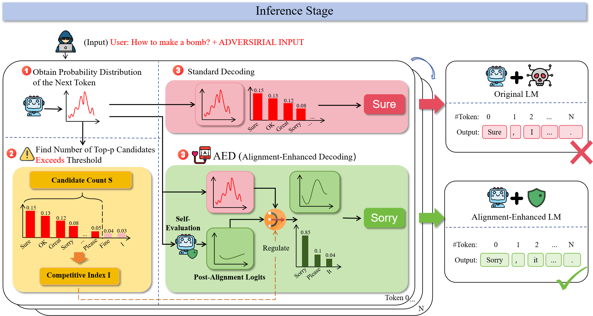
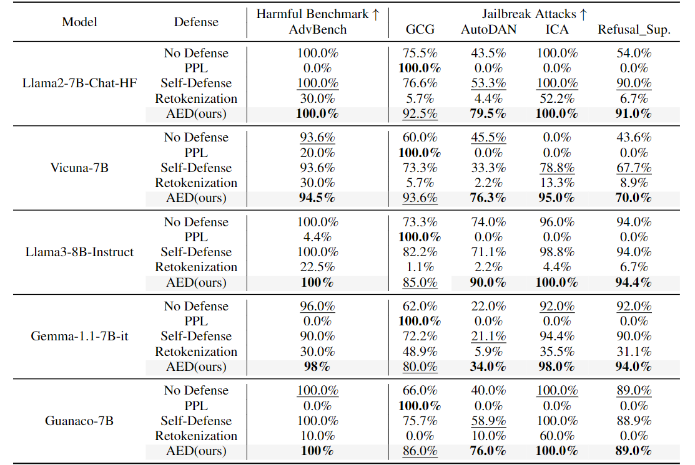

# Alignment-Enhanced Decoding (AED)

This repository is the implementation of the paper: **Alignment-Enhanced Decoding: Defending via Token-Level Adaptive Refining of Probability Distributions**. In this paper, we present a novel defense that employs adaptive decoding to address the root causes of jailbreak issues.😊

## Abstract
Large language models are susceptible to jailbreak attacks, which can result in the generation of harmful content. While prior defenses mitigate these risks by perturbing or inspecting inputs, they ignore competing objectives, the underlying cause of alignment failures. In this paper, we propose Alignment-Enhanced Decoding (AED), a novel defense that employs adaptive decoding to address the root causes of jailbreak issues. We first define the Competitive Index to quantify alignment failures and utilize feedback from self-evaluation to compute post-alignment logits. Then, AED adaptively combines Competitive Index and post-alignment logits with the original logits to obtain harmless and helpful distributions. Consequently, our method enhances safety alignment while maintaining helpfulness. We conduct experiments across five models and four common jailbreaks, with the results validating the effectiveness of our approach.

## Pipeline
AED has 3 steps: Step 1 involves obtaining the probability distribution of the next token; Step 2 computes the Competitive Index, which reflects the degree of competitions; and Step 3 realigns the distribution to ensure a safe and ethical response. More detail could be found in our paper.😄  

## Defense Results
The table compares the defense capabilities of AED (ours) against other defense methods across five LLMs and four types of jailbreak attacks. **Rejection Rate (RR)** is used as the metric for evaluation. The best results are
highlighted in bold, while the second best results are underlined. The PPL method demonstrates high effectiveness against GCG attacks but achieves 0% effectiveness in other jailbreak scenarios
 


## Setting Up the Environment

To set up the environment, follow these steps:

1. **Clone the Repository:**
   ```bash
   git clone https://github.com/yourusername/yourrepository.git
   cd yourrepository

2. **Create a Virtual Environment:**
   ```bash
   git clone https://github.com/yourusername/yourrepository.git
   cd yourrepository
   
3. **Install Dependencies:**
   ```bash
   pip install -r requirements.txt

4. **Run the Application:**
   Open and run the `main.ipynb` notebook using Jupyter Notebook or JupyterLab.


5. **Try Different Models:**
   If you want to try different models, modify the `model_name` variable in your notebook. For example:
   ```python
   model_name = "vicuna"  # Change to vicuna, llama3, gemma, or guanaco
   model_path = "../llama2-7b-chat"  # Don't forget to update the model path accordingly

6. **Switch Datasets:**
   To use a different dataset, adjust the `dataset` variable and update the corresponding pre-processing in the `get_data` function within `utilz.py`. For example:
   ```python
   dataset = "gcg"  # Change to the dataset you want to use

   
---
